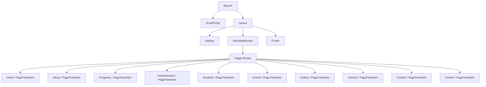

# Project Architecture

This document describes the high-level layout, routing, data-flow, and component hierarchy structures designed for the Salience Foundation website.

---

## 1. High-Level Flow Diagram

The application is structured as a client-side SPA (Single Page Application) managed by React Router v7. The top-level hierarchy is structured as follows:

---

## 2. Layout & Preserved Components

- **Layout Structure**: Located in `src/components/layout/Layout.jsx`, the layout manages the top-level viewport and holds the global `Navbar` and `Footer` components.
- **Navbar Persistence**: To prevent abrupt flashes and re-mounting layout shifts when navigating between routes, the `Navbar` remains mounted within the root `Layout.jsx` wrapper rather than being declared inside individual page views.
- **Scroll-Linked Transition**: 
  - Sub-pages with full-screen heroes (`/`, `/programs`, `/partner`, `/contact`, `/gallery`, `/policies`, `/achievements`, `/students`, `/events`) load the navbar with a transparent background.
  - As the user scrolls past the hero (150px scroll threshold), Framer Motion interpolates the style from transparent with white text to a solid white background with dark grey text.
  - For non-hero pages (e.g. `/about`), the navbar immediately defaults to its solid state to prevent text readability issues.

---

## 3. Routing Lifecycle & Navigation

- **Router**: Controlled by `<BrowserRouter>` in `src/App.jsx`.
- **Page Transitions**: Each route's view is wrapped in a `<PageTransition>` component utilizing Framer Motion's `<AnimatePresence mode="wait">` to perform clean fade-out / fade-in transitions.
- **Scroll Alignment**: The `<ScrollToTop>` helper executes synchronously inside `useLayoutEffect` on route changes to ensure page viewports start at the top before rendering/painting, eliminating jumpy animations.

---

## 4. Shared Utilities & State Flows

- **Client Hydration State**: Interactive widgets like `InteractiveMap` (Leaflet) are isolated inside client mount hooks (`mounted` state verified in `useEffect`) to ensure script assets compile safely in hybrid or hydration environments without missing browser globals (`window` or `document`).
- **Data Flow**: Page views remain visual coordinators and do not hardcode metadata. All copy, lists, icons, and FAQ sets flow downwards from read-only configurations in `src/constants/*Data.jsx`.
